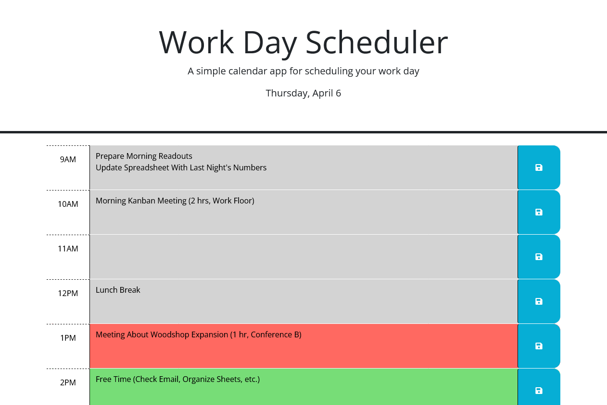

# Day Planner

## Description
This challenge was to create a day planner using some provided starter code. What I added was JavaScript functionality for saving and retrieving data stored in the individual time slots. I also added DayJS functionality to display the current day and compare the current time against the timeslots, showing which were in the past, present, or future using dynamic CSS.

This project taught me a lot about proper JQuery notation, since I encountered a lot of errors based on not using proper notation, or mixing JQuery and JavaScript syntax. It also taught me about DayJS and how useful it is compared to standard date manipulation. 

## Credits
The starter code was provided by the bootcamp.

## Website Link
The finished website can be found [here!](https://alecryanhunter.github.io/Day-Planner/)

## Screenshots
